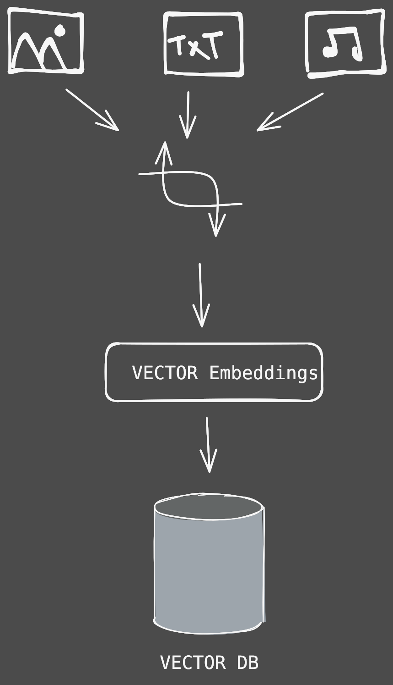
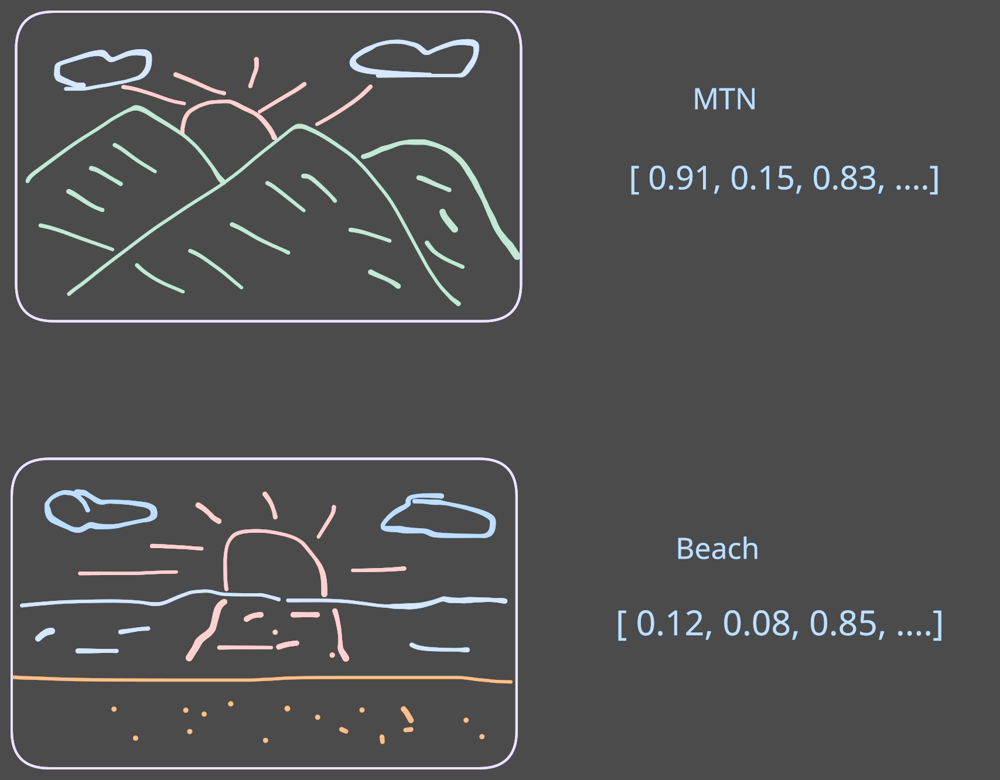

# Vector Database

## What is a Vector Database

- A vector database is designed to store and retrieve unstructured data, such as images, text, and audio, by representing this data as mathematical vector embeddings.
- Traditional relational databases can store basic information about images, such as binary data and metadata like file format and creation date, but they struggle to capture the semantic context of the data.
- The limitations of traditional databases highlight the concept known as the semantic gap, which refers to the disconnect between how data is stored and how humans understand it.
- Vector databases address these limitations by allowing for similarity searches that leverage the mathematical properties of vector embeddings, enabling the retrieval of semantically similar content.

---

## Vector Embeddings Explained

- Vector embeddings are arrays of numbers that capture the essential characteristics of data, where similar items are positioned close together in vector space.
- These embeddings allow for complex unstructured data, such as images or audio, to be transformed into a format that can be stored in a vector database.
- For instance, an image of a mountain can be represented as a vector embedding with dimensions that reflect features like elevation changes and color characteristics.
- The representation of images as vector embeddings enables the comparison of different images based on their features, facilitating the discovery of similar visuals.

---

## different embedding models for different data formats

### 1. **Text**

- **Purpose**: Convert text into dense vector representations capturing semantic meaning.
- **Popular Models**:
  - **BERT** (Bidirectional Encoder Representations from Transformers)
  - **RoBERTa**, **DistilBERT**
  - **OpenAI embeddings** (e.g., `text-embedding-3-small`, `text-embedding-ada-002`)
  - **Sentence-BERT (SBERT)** – optimized for sentence similarity
  - **GloVe**, **FastText**, **Word2Vec** – older, non-contextual

### 2. **Images**

- **Purpose**: Convert visual content into vector embeddings.
- **Popular Models**:
  - **CLIP (OpenAI)** – aligns images and text in a shared embedding space
  - **ResNet**, **EfficientNet**, **Vision Transformers (ViT)** – for general image features
  - **DINOv2 (Meta)** – self-supervised learning for general-purpose vision tasks

### 3. **Audio**

- **Purpose**: Represent audio waveforms or spectrograms in vector space.
- **Popular Models**:
  - **Wav2Vec 2.0 (Facebook AI)** – speech representation
  - **YAMNet** – sound event classification (based on MobileNet)
  - **OpenL3** – general-purpose audio embeddings
  - **Whisper (OpenAI)** – for speech transcription, can also extract embeddings

### 4. **Video**

- **Purpose**: Capture temporal and spatial features in video.
- **Popular Models**:
  - **TimeSformer** – transformer for video data
  - **VideoCLIP** – like CLIP but for videos
  - **SlowFast**, **I3D** – for action recognition in videos

### 5. **Structured / Tabular Data**

- **Purpose**: Embed rows of data with mixed types (categorical, numeric).
- **Popular Models**:
  - **TabNet (Google)** – deep learning for tabular data
  - **FT-Transformer**, **NODE** – transformer and ensemble models for tables
  - Embedding categorical variables + scaling numeric columns

### 6. **Multimodal (Text + Image, etc.)**

- **Purpose**: Embed multiple data types into a **shared** space.
- **Popular Models**:
  - **CLIP** – joint vision and text embedding
  - **Flamingo**, **BLIP**, **GIT** – for vision-language tasks
  - **LLaVA**, **MiniGPT-4** – multimodal language models
  - **Gemini (Google)**, **GPT-4V (OpenAI)** – powerful multimodal models

---

## Creating Vector Embeddings

- Vector embeddings are created using embedding models, which are trained on large datasets specific to the type of data being processed, such as images, text, or audio.
- Different models, like Clip for images, GloVe for text, and Wav2vec for audio, are employed to extract features from the data as it passes through multiple layers of the model.
- As data moves through these layers, progressively more abstract features are identified, from basic elements like edges in images to complex concepts in text.
- The resulting high-dimensional vectors capture the essential characteristics of the input data, enabling advanced operations that traditional databases cannot perform.

## Vector Indexing for Efficient Searches

- Vector indexing is a crucial process that enhances the efficiency of searching through large datasets of vector embeddings, which can contain millions of vectors across numerous dimensions.
- Using techniques like approximate nearest neighbor (ANN) algorithms, vector indexing quickly identifies vectors that are likely to be close to a query vector without needing to compare every vector in the database.
- Examples of vector indexing methods include Hierarchical Navigable Small World (HNSW), which creates multi-layered graphs of similar vectors, and Inverted File Index (IVF), which clusters vector space for more focused searches.
- These indexing methods improve search speed significantly while trading off a small degree of accuracy, making them effective for practical applications.

## Applications of Vector Databases

- Vector databases play a pivotal role in retrieval augmented generation (RAG), where they store chunks of documents and knowledge bases as embeddings.
- When a user poses a question, the system retrieves relevant text chunks by comparing vector similarities and then feeds this information to a large language model to generate responses.
- This capability allows for quick and semantically relevant retrieval of information, making vector databases essential for modern data-driven applications.
- Overall, vector databases serve both as storage solutions for unstructured data and as powerful tools for semantic retrieval, enhancing the capabilities of various AI and machine learning systems.
